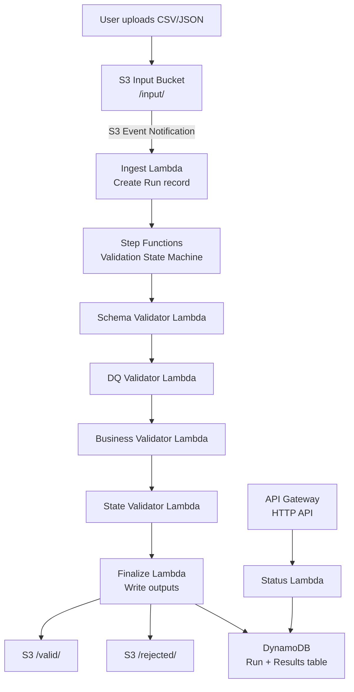

# Design Document: Credit Card DQ Validation

## Overview

A fully serverless AWS data quality validation pipeline for synthetic credit-card test data. Input files (CSV or JSON) are uploaded to S3, which triggers an AWS Step Functions state machine. The state machine sequences four Lambda-based validators (schema, DQ, business rules, state rules) and writes per-record results to DynamoDB and S3. An API Gateway HTTP API exposes run status and results. The entire system is defined in an AWS SAM template and deployable with `sam deploy`.

---

## Architecture



The pipeline is a Standard Workflow in Step Functions, which provides full execution history, per-step auditing, and at-least-once execution semantics. Each Lambda validator receives a batch of records and returns annotated results; the state machine passes results forward as state machine input/output.

---

## Components and Interfaces

### Lambda Functions

| Function | Trigger | Responsibility |
|---|---|---|
| `ingest` | S3 Event | Parse input file, create Run record in DynamoDB, start Step Functions execution |
| `schema_validate` | Step Functions Task | Validate schema for all records; annotate with schema_status |
| `dq_validate` | Step Functions Task | Validate DQ rules; annotate with dq_status |
| `business_validate` | Step Functions Task | Validate business rules; annotate with business_status |
| `state_validate` | Step Functions Task | Apply state-specific rules; annotate with state_status |
| `finalize` | Step Functions Task | Compute overall_status, write to S3 valid/rejected, update DynamoDB |
| `status` | API Gateway GET | Read Run and Result records from DynamoDB, return JSON |

### Rule Packs

Rule packs are JSON files stored in S3 under `/rule-packs/`. Each validator loads its rule pack at cold start and caches it for the Lambda lifetime.

```
/rule-packs/
  schema_rules.json       # field definitions, types, required flags, enums
  dq_rules.json           # mandatory fields, uniqueness keys, format patterns
  business_rules.json     # delinquency bucket mappings, allowed product types
  state_rules.json        # per-state required fields, disallowed statuses, extra checks
```

### Step Functions State Machine (ASL summary)

```
StartAt: SchemaValidate
States:
  SchemaValidate:
    Type: Task → schema_validate Lambda
    Retry: [MaxAttempts: 2, BackoffRate: 2]
    Catch: → RunError
    Next: DQValidate

  DQValidate:
    Type: Task → dq_validate Lambda
    Retry: [MaxAttempts: 2, BackoffRate: 2]
    Catch: → RunError
    Next: BusinessValidate

  BusinessValidate:
    Type: Task → business_validate Lambda
    Retry: [MaxAttempts: 2, BackoffRate: 2]
    Catch: → RunError
    Next: StateValidate

  StateValidate:
    Type: Task → state_validate Lambda
    Retry: [MaxAttempts: 2, BackoffRate: 2]
    Catch: → RunError
    Next: Finalize

  Finalize:
    Type: Task → finalize Lambda
    End: true

  RunError:
    Type: Task → finalize Lambda (error path)
    End: true
```

---

## Data Models

### Input Record (CSV/JSON row)

```python
{
  "record_id": str,           # unique identifier for this row
  "account_id": str,          # credit card account identifier
  "tradeline_id": str,        # tradeline identifier (unique per record)
  "product_type": str,        # must be "CREDIT_CARD"
  "state_code": str,          # two-letter US state abbreviation
  "zip_code": str,            # 5-digit or 5+4 format
  "reporting_date": str,      # ISO 8601 YYYY-MM-DD
  "account_status": str,      # OPEN | CLOSED | DELINQUENT | ...
  "payment_status": str,      # CURRENT | 30_DAYS | 60_DAYS | 90_DAYS | ...
  "current_balance": float,
  "credit_limit": float,
  "available_credit": float,
  "past_due_amount": float,
  "close_date": str | None,   # ISO 8601, required when account_status=CLOSED
  "delinquency_bucket": str,  # must align with payment_status
  "dispute_flag": bool,
}
```

### Validation Result (DynamoDB item + S3 output)

```python
{
  "run_id": str,
  "record_id": str,
  "schema_status": "PASS" | "FAIL",
  "dq_status": "PASS" | "FAIL",
  "business_status": "PASS" | "FAIL",
  "state_status": "PASS" | "FAIL" | "REVIEW_REQUIRED",
  "overall_status": "PASS" | "FAIL",
  "reportable": bool,
  "failure_reasons": list[str]   # empty list when PASS
}
```

### DynamoDB Tables

**Table: `ValidationRuns`**
- Partition key: `run_id` (String)
- Attributes: `status`, `input_s3_key`, `execution_arn`, `total_records`, `passed_count`, `failed_count`, `created_at`, `completed_at`

**Table: `ValidationResults`**
- Partition key: `run_id` (String)
- Sort key: `record_id` (String)
- Attributes: all fields from Validation Result model above

### Rule Pack Schemas

**schema_rules.json**
```json
{
  "required_fields": ["record_id", "account_id", ...],
  "field_types": {"current_balance": "float", "reporting_date": "date", ...},
  "enum_fields": {"account_status": ["OPEN", "CLOSED", ...], ...}
}
```

**state_rules.json**
```json
{
  "CA": {
    "required_fields": ["state_code", "reporting_date"],
    "disallowed_statuses": [],
    "extra_checks": ["DISPUTE_CONSISTENCY"]
  },
  "NY": {
    "required_fields": ["state_code", "reporting_date"],
    "disallowed_statuses": [],
    "extra_checks": ["CLOSE_DATE_LOGIC"]
  }
}
```

---

## Correctness Properties

*A property is a characteristic or behavior that should hold true across all valid executions of a system — essentially, a formal statement about what the system should do. Properties serve as the bridge between human-readable specifications and machine-verifiable correctness guarantees.*

### Property 1: Schema validation rejects structurally invalid records

*For any* input record missing a required field or containing a type-mismatched value, the schema_validate function SHALL return a result with schema_status = FAIL and at least one failure_reason code beginning with SCHEMA_

**Validates: Requirements 2.1, 2.2, 2.3, 2.4, 2.7, 2.8**

---

### Property 2: DQ validation rejects records with null mandatory fields

*For any* input record where a mandatory field is null or empty string, the dq_validate function SHALL return a result with dq_status = FAIL and failure_reason DQ_NULL_MANDATORY

**Validates: Requirements 3.1, 3.2**

---

### Property 3: DQ duplicate detection

*For any* dataset containing two or more records with the same account_id, the dq_validate function SHALL assign DQ_DUPLICATE_ACCOUNT_ID to all duplicate records. The same property holds for tradeline_id with reason code DQ_DUPLICATE_TRADELINE_ID.

**Validates: Requirements 3.3, 3.4, 3.5, 3.6**

---

### Property 4: Business rule — available credit invariant

*For any* record where schema and DQ validation pass, if available_credit ≠ credit_limit − current_balance, the business_validate function SHALL return business_status = FAIL with reason code BUS_AVAILABLE_CREDIT_MISMATCH

**Validates: Requirements 4.7, 4.8**

---

### Property 5: Business rule — payment status consistency

*For any* record where payment_status = CURRENT, the business_validate function SHALL return business_status = FAIL with reason code BUS_PAST_DUE_CONFLICT if and only if past_due_amount ≠ 0

**Validates: Requirements 4.9, 4.10**

---

### Property 6: Business rule — closed account close date

*For any* record where account_status = CLOSED and close_date is absent or null, the business_validate function SHALL return business_status = FAIL with reason code BUS_MISSING_CLOSE_DATE

**Validates: Requirements 4.11, 4.12**

---

### Property 7: State rule — unknown state falls back to REVIEW_REQUIRED

*For any* record whose state_code has no entry in the state_rules Rule_Pack, the state_validate function SHALL return state_status = REVIEW_REQUIRED and failure_reason STATE_NO_RULE_FOUND

**Validates: Requirements 5.3**

---

### Property 8: Overall status is the conjunction of all stage statuses

*For any* Validation_Result, overall_status = PASS if and only if schema_status = PASS AND dq_status = PASS AND business_status = PASS AND state_status = PASS (REVIEW_REQUIRED counts as non-PASS)

**Validates: Requirements 6.1, 6.2, 6.3**

---

### Property 9: Failure reasons are non-empty for every FAIL record

*For any* Validation_Result where overall_status = FAIL, the failure_reasons list SHALL be non-empty

**Validates: Requirements 6.4**

---

### Property 10: Validation result round trip (DynamoDB serialization)

*For any* Validation_Result object, serializing it to a DynamoDB item and deserializing it back SHALL produce an equivalent object with all fields intact

**Validates: Requirements 6.5**

---

## Error Handling

| Scenario | Behavior |
|---|---|
| Input file is empty | Ingest Lambda writes a Run with status=ERROR and reason PARSE_ERROR; no Step Functions execution started |
| Input file is unparseable (bad CSV/JSON) | Same as above |
| Lambda unhandled exception | Step Functions retries up to 2 times; on final failure, transitions to RunError state, Finalize Lambda marks Run as ERROR |
| DynamoDB write failure | Lambda raises exception; Step Functions retry handles it |
| S3 write failure | Lambda raises exception; Step Functions retry handles it |
| Unknown state_code | State Validator assigns REVIEW_REQUIRED (not ERROR); pipeline continues |
| Missing rule pack in S3 | Lambda raises exception at cold start; Step Functions retry handles it |

---

## Testing Strategy

### Dual Testing Approach

Both unit tests and property-based tests are required. They are complementary:
- Unit tests verify specific examples, edge cases, and error conditions
- Property-based tests verify universal properties hold across many generated inputs

### Property-Based Testing

Use [Hypothesis](https://hypothesis.readthedocs.io/) (Python) for all property-based tests.

Each property test MUST:
- Run a minimum of 100 examples (configured via `@settings(max_examples=100)`)
- Be annotated with a comment referencing the design property it validates
- Use smart generators that constrain inputs to the valid input space

Tag format: `# Feature: credit-card-dq-validation, Property {N}: {property_text}`

Each correctness property listed above MUST be implemented as a single Hypothesis property test.

### Unit Testing

Use `pytest` for unit tests. Focus on:
- Specific examples demonstrating correct behavior for each validator
- Edge cases: empty datasets, single-record datasets, all-pass datasets, all-fail datasets
- Error conditions: missing rule packs, malformed input files, DynamoDB write errors (mocked)
- Integration between validators (output of one feeds input of next)

### Test File Layout

```
tests/
  unit/
    test_schema_validator.py
    test_dq_validator.py
    test_business_validator.py
    test_state_validator.py
    test_finalize.py
    test_result_model.py
  property/
    test_schema_properties.py    # Properties 1
    test_dq_properties.py        # Properties 2, 3
    test_business_properties.py  # Properties 4, 5, 6
    test_state_properties.py     # Property 7
    test_result_properties.py    # Properties 8, 9, 10
  conftest.py                    # shared fixtures and generators
```

### Hypothesis Generators

Key generators to implement in `conftest.py`:

```python
# Valid record generator — produces structurally correct records
@st.composite
def valid_record(draw): ...

# Invalid record generator — introduces one or more violations
@st.composite
def invalid_record(draw, violation_type): ...

# Dataset generator — list of N records with controlled duplicates
@st.composite
def record_dataset(draw, min_size=1, max_size=50): ...
```
